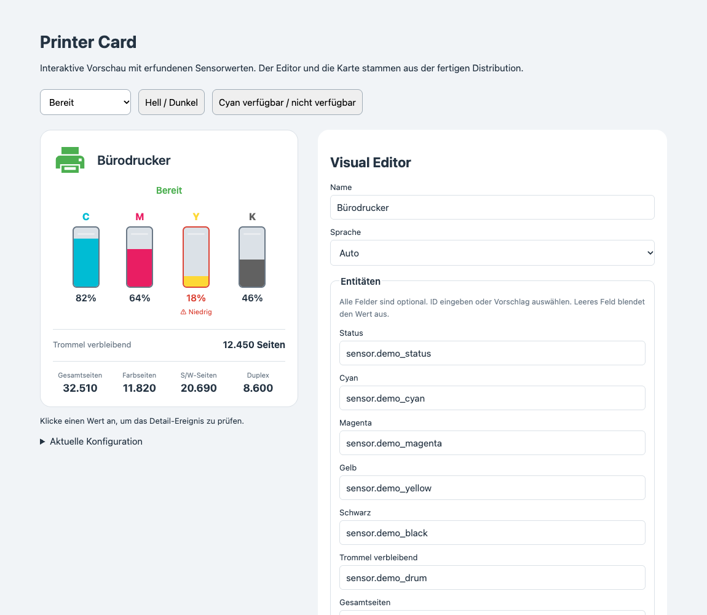

# Printer Card

Eine eigenständige Home-Assistant-Lovelace-Karte mit vertikalen **C/M/Y/K-Kartuschen**, Statusanzeige und grafischem Konfigurationseditor. Inspiriert von einer Brother-Druckerkarte, aber ohne Herstellerbindung, fest vorgegebene Entitäts-IDs oder Abhängigkeit von `button-card`.



☕ **Gefällt dir Printer Card?**  
Wenn du das Projekt unterstützen möchtest, kannst du mir gerne einen Kaffee spendieren:  
[Buy Me a Coffee](https://buymeacoffee.com/soso1999)

## Funktionen

- Dreizehn frei zuweisbare Entitäten: Status, Cyan, Magenta, Gelb, Schwarz, Trommel, Gesamtseiten, Farbseiten, S/W-Seiten und Duplex.
- Alle Zuordnungen optional; nicht konfigurierte Werte werden ausgeblendet. Auch reine Schwarzweißdrucker funktionieren.
- Grafischer Editor mit durchsuchbaren Vorschlägen aller vorhandenen Entitäts-IDs samt Anzeigenamen. IDs lassen sich auch direkt eintragen und löschen.
- Statusfarben: bereit (grün), druckt (blau), Energiesparen (grau), kein Papier (rot), sonstiger Zustand (orange).
- Anpassbare Statusmuster einschließlich Fach 1/Fach 2; deutsch/englische Vorgaben.
- Optionaler pulsierender Drucker, Papierauswurf und Tonerwarnung bei ≤ 20 % (Grenze einstellbar).
- Hell-/Dunkel-Themes, mobile Darstellung, Tastaturbedienung und `prefers-reduced-motion`.
- Klick auf den Druckerkopf oder einen Sensor öffnet dessen Home-Assistant-Detaildialog.
- Lokale Einzeldatei; keine externen Schriftarten, CDN-Imports oder Laufzeitpakete.

## Direkt installieren

Ein Build ist für die Nutzung **nicht erforderlich**. `dist/printer-card.js` ist bereits enthalten.

1. `dist/printer-card.js` nach `<config>/www/printer-card.js` kopieren; `www` gegebenenfalls anlegen.
2. Im Dashboard unter **Ressourcen** die URL `/local/printer-card.js` als **JavaScript-Modul** hinzufügen. Die Ressourcenverwaltung findet sich in den Dashboard-Einstellungen und kann den erweiterten Modus im Benutzerprofil erfordern.
3. Browser vollständig neu laden. Dashboard bearbeiten → Karte hinzufügen → **Printer Card**.
4. Im Visual Editor die gewünschten Entitäten auswählen. Änderungen an Textfeldern werden beim Verlassen des Feldes übernommen. Eine leere Zuordnung entfernt die Anzeige.

Falls die Karte noch nicht in der Kartenauswahl erscheint, eine manuelle Karte mit folgendem Inhalt anlegen und anschließend den visuellen Editor öffnen:

```yaml
type: custom:printer-card
```

Bei YAML-verwalteten Dashboard-Ressourcen:

```yaml
resources:
  - url: /local/printer-card.js
    type: module
```

Bei Updates Browsercache leeren oder die Ressourcen-URL um eine Versionsabfrage wie `?v=1.0.1` ergänzen. Jede Distribution nur einmal als Ressource laden.

## Installation über HACS

Dieses Projekt ist für ein **öffentliches GitHub-Repository `printer-card`** vorbereitet; alternativ ist `lovelace-printer-card` möglich. Es ist noch nicht veröffentlicht oder in HACS aufgenommen.

Nach der Veröffentlichung:

1. HACS → Menü → Benutzerdefinierte Repositories.
2. Die URL des veröffentlichten Repositorys eintragen; Kategorie **Dashboard** (intern `plugin`) wählen.
3. **Printer Card** herunterladen.
4. Prüfen, dass `/hacsfiles/printer-card/printer-card.js` als JavaScript-Modul eingetragen ist; falls HACS sie nicht automatisch angelegt hat, diese Ressource ergänzen. Bei anderem Repositorynamen den Ordner entsprechend ändern.
5. Browser neu laden und die Karte konfigurieren.

`hacs.json` verweist auf `printer-card.js`; die Distribution liegt in `dist/`. Für HACS ist kein ZIP-Release vorgesehen: GitHub-Releases enthalten die einzelne JavaScript-Datei. Die Aufnahme in die HACS-Standardliste ist ein separater Prozess und keine Voraussetzung für die Nutzung als benutzerdefiniertes Repository.

## Konfiguration

Alle Optionen sind über den Visual Editor zugänglich. Es werden keine Entitäten anhand eines Druckermodells automatisch vorausgewählt. Die folgende Konfiguration enthält absichtlich leere IDs; diese im Editor zuweisen oder durch eigene IDs ersetzen.

```yaml
type: custom:printer-card
name: Bürodrucker
language: auto
animation: true
toner_warning: true
warning_threshold: 20
entities:
  status: ""
  cyan: ""
  magenta: ""
  yellow: ""
  black: ""
  drum: ""
  total: ""
  color: ""
  bw: ""
  duplex: ""
```

| Option | Standard | Bedeutung |
| --- | --- | --- |
| `name` | leer | Titel; sonst Anzeigename der Statusentität oder „Drucker“ |
| `language` | `auto` | `auto`, `de` oder `en`; automatisch anhand der HA-Sprache |
| `entities` | `{}` | Frei gewählte Entitäts-IDs für die zehn Felder |
| `animation` | `true` | Druck- und Warnanimationen; Statusfarben bleiben aktiv |
| `toner_warning` | `true` | Warnrahmen und „Niedrig“ bei Toner unter/gleich der Grenze |
| `warning_threshold` | `20` | Prozentgrenze von 0 bis 100 |
| `status_patterns` | siehe unten | Musterlisten pro Kategorie |

Tonerentitäten müssen den **verbleibenden Prozentwert** liefern. Zahlen und Prozentstrings wie `42`, `42%` oder `42,5` werden akzeptiert und auf 0–100 begrenzt. Es wird nicht automatisch aus Seitenständen, Kapazitäten oder einem verbrauchten Anteil umgerechnet; dafür gegebenenfalls einen HA-Template-Sensor vorschalten.

Die Trommel kann Prozent oder Restseiten liefern: Wert und `unit_of_measurement` der Entität werden angezeigt. Bei deutscher Anzeigesprache wird die Einheit `page`/`pages` als „Seiten“ angezeigt. Die anderen Zähler werden ebenfalls mit ihrer vorhandenen Einheit dargestellt; Duplex ist ein Anzeigewert, kein Schalter. Für die Daten ist eine passende Drucker-/SNMP-/Template-Integration erforderlich. Die Karte fragt selbst keinen Drucker ab.

`unknown`, `unavailable`, leere und ungültige Tonerwerte erscheinen als **—**, nicht als 0 %. Zugewiesene, aber nicht gefundene Entitäten werden zusätzlich unter der Karte benannt. Nicht erkannte Druckerzustände bleiben im Original sichtbar. Erkannte Zustände werden nur einmal als übersetzter Status angezeigt.

### Statusmuster

Standardkonfiguration:

```yaml
status_patterns:
  no_paper:
    - kein papier
    - no paper
    - no-paper
    - paper empty
    - out of paper
    - papier leer
  printing:
    - printing
    - ausdruck
    - '=druckt'
  powersave:
    - powersave
    - power save
    - energiesparen
    - sleep
    - ruhezustand
  ready:
    - '=ready'
    - '=bereit'
    - '=idle'
  tray1:
    - '*z1*'
    - '*fach 1*'
    - '*tray 1*'
    - '*tray1*'
  tray2:
    - '*z2*'
    - '*fach 2*'
    - '*tray 2*'
    - '*tray2*'
```

- Groß-/Kleinschreibung und äußere Leerzeichen werden ignoriert.
- Ohne Sonderzeichen: Teilstring, z. B. `kein papier` erkennt `Kein Papier Z1`.
- Präfix `=`: exakte Übereinstimmung, z. B. `=ready`. Damit wird `not ready` nicht fälschlich als bereit erkannt.
- `*` steht für beliebig viele Zeichen, `?` für genau ein Zeichen. Wildcardmuster gelten für den gesamten Status; `*fach 2*` findet Fach 2 innerhalb eines längeren Textes.
- Keine regulären Ausdrücke. Pro Muster maximal 200 Zeichen.
- Eine eigene Liste **ersetzt** die Vorgaben dieser Kategorie. Nicht angegebene Kategorien behalten ihre Vorgaben. `[]` deaktiviert eine Kategorie.
- Priorität: fehlender/unverfügbarer Status → kein Papier → druckt → Energiesparen → bereit → sonstiger Rohtext.
- Fachmuster werden ausschließlich nach erkanntem Papierfehler ausgewertet. Treffen beide zu, werden beide Fächer angezeigt.

Im Editor unter **Status-Erkennung anpassen** steht jedes Muster in einer eigenen Zeile. Beispiel für einen Drucker mit anderen Statuscodes:

```yaml
status_patterns:
  ready: ['=online']
  printing: ['=busy']
  no_paper: ['*paper_empty*']
  tray1: ['*input_1*']
  tray2: ['*input_2*']
```

## Entwickeln und testen

Node.js **22 oder neuer empfohlen**; Build und Logiktests benötigen keine npm-Abhängigkeiten und keine Installation von Paketen.

```sh
npm run check
```

Das führt die Logiktests aus, baut `dist/printer-card.js` und prüft dessen Syntax. Den generierten `dist/`-Ordner mit einchecken. Der kleine Builder verbindet die vier lokalen Module in festgelegter Reihenfolge; er unterstützt deren einzeilige Imports und benannte Deklarationsexporte. Für zusätzliche Paketabhängigkeiten sollte er durch einen regulären Bundler ersetzt werden.

### Interaktive Demo

Im Projektordner einen lokalen HTTP-Server starten, zum Beispiel:

```sh
python3 -m http.server 8000 --bind 127.0.0.1
```

Dann `http://127.0.0.1:8000/demo/` im Browser öffnen. Die Demo lädt die echte Distribution und liefert ausschließlich erfundene Sensorwerte. Der Detaildialog wird dort durch die Anzeige des gesendeten Ereignisses ersetzt. Die HTML-Datei über HTTP öffnen, nicht per Doppelklick (`file://`).

### Optionaler Browsertest

Benötigt lokal installiertes Google Chrome und Playwright. Die Browserabhängigkeit wird nicht für den Kartenbetrieb benötigt:

```sh
npm install --no-save --package-lock=false playwright
node scripts/browser-test.mjs
```

Der Test startet nur einen temporären Server auf `127.0.0.1` und ein isoliertes Chrome-Testprofil. Er prüft die gebaute Karte, Änderungen im Visual Editor, Entity-Auswahl/-Entfernung, Muster, fehlende Werte, HTML-Escaping, Klickereignisse, mobile Darstellung, dunkles Theme und reduzierte Bewegung. Er aktualisiert die Vorschaubilder in `demo/`.

Siehe [VALIDATION.md](VALIDATION.md) für den tatsächlich geprüften Umfang und den noch offenen Test in einer echten HA-Installation.

## Auf GitHub veröffentlichen

1. Öffentliches Repository `printer-card` anlegen.
2. **Den Inhalt dieses Ordners** ins Repository-Stammverzeichnis übernehmen (nicht einen zusätzlichen umschließenden `printer-card`-Ordner).
3. Repository-Beschreibung und Topics wie `home-assistant`, `lovelace`, `hacs`, `custom-card`, `printer` ergänzen.
4. `npm run check` ausführen und einschließlich `dist/printer-card.js` committen/pushen. Der Check-Workflow prüft auch, ob die eingecheckte Distribution aktuell ist.
5. Für ein Release die Version in `package.json` aktualisieren, neu bauen, committen und einen passenden Tag wie `v1.0.0` pushen. Der Release-Workflow prüft Tag/Version und hängt die Distribution an das GitHub-Release an.
6. Das Repository in HACS als benutzerdefiniertes Dashboard-Repository hinzufügen und in einer echten HA-Instanz testen.

Das lokale Projekt erzeugt oder veröffentlicht selbst kein GitHub-Repository. Die Workflows laufen erst im späteren Repository.

## Dateien

```text
src/                     Kartenlogik, Darstellung, Editor
scripts/build.mjs        Abhängigkeitsfreier Build
scripts/browser-test.mjs Optionaler Test mit Playwright/Chrome
test/                    Logiktests mit node:test
dist/printer-card.js     Direkt installierbare Distribution
demo/                    Interaktive Demo und Vorschaubilder
.github/workflows/       Checks und Release mit JS-Anhang
hacs.json                HACS-Metadaten
```

## Referenzen

Die Schnittstellen für `setConfig`, `hass`, `getConfigElement` und `config-changed` orientieren sich an der [Home-Assistant-Dokumentation für Custom Cards](https://developers.home-assistant.io/docs/frontend/custom-ui/custom-card/). Die Repository-Struktur folgt den [HACS-Anforderungen für Dashboard-Plugins](https://www.hacs.dev/docs/publish/plugin/) und den [allgemeinen HACS-Metadaten](https://www.hacs.dev/docs/publish/start/).

## Lizenz

MIT, siehe [LICENSE](LICENSE).
